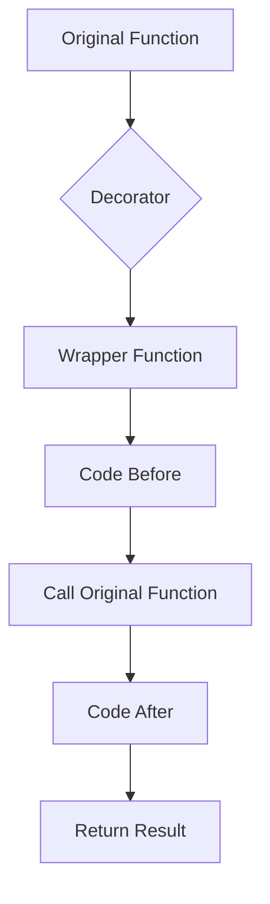

# Introduction to Python Decorators

Welcome to the comprehensive guide on Python Decorators! This repository is designed as a step-by-step tutorial to help you understand how decorators work, from the ground up.

Python decorators are a powerful and elegant way to modify or extend the behavior of functions or classes without changing their source code.

## 📋 Table of Contents

1. [Functions are Objects](#1-functions-are-objects)
2. [Functions Inside Functions](#2-functions-inside-functions)
3. [Function References](#3-function-references)
4. [Handcrafted Decorators](#4-handcrafted-decorators)
5. [Decorators Demystified](#5-decorators-demystified)
6. [Useful Examples](#6-useful-examples)
7. [Passing Arguments to Decorated Functions](#7-passing-arguments-to-decorated-functions)
8. [Decorating Methods](#8-decorating-methods)
9. [Passing Arguments to Decorators](#9-passing-arguments-to-decorators)
10. [Decorators with Arguments](#10-decorators-with-arguments)
11. [Decorator to Decorate a Decorator](#11-decorator-to-decorate-a-decorator)
12. [Best Practices (`functools.wraps`)](#12-best-practices)
13. [Class-Based Decorators](#13-class-based-decorators)
14. [Built-in Decorators](#14-built-in-decorators)

---

## 📝 Original Inspiration
This tutorial was inspired by an excellent [StackOverflow answer](http://stackoverflow.com/questions/739654/how-can-i-make-a-chain-of-function-decorators-in-python).

## 🛠️ How it Works

### High-Level Concept

### 1. Functions are Objects
In Python, functions are first-class objects. You can assign them to variables, delete names, and pass them as arguments.
- See: `01_functions_are_objects.py`

### 2. Functions Inside Functions
You can define a function inside another function. The inner function is only accessible within the outer function unless you return it.
- See: `02_define_function_inside_function.py`

### 3. Function References
When you return a function from another function, you are returning a reference to that function.
- See: `03_functions_references.py`

### 4. Handcrafted Decorators
A decorator is just a function that takes another function as an argument and returns a new function (a wrapper).
- See: `04_handcrafted_decorators.py`

### 5. Decorators Demystified
The `@decorator` syntax is just "syntactic sugar" for `func = decorator(func)`.
- See: `05_decorators_demystified.py`

### 6. Passing Arguments
To decorate functions that take arguments, use `*args` and `**kwargs` in the wrapper.
- See: `07_passing_arguments_to_the_decorated_function.py`

### 7. Decorating Methods
Methods are just functions where the first argument is `self`. Decorators work on them too!
- See: `08_decorating_methods.py`

### 8. Decorators with Arguments
You can even pass arguments to the decorator itself. This requires three levels of nested functions:
1. A function that accepts the decorator arguments and returns a decorator.
2. The decorator that accepts the function and returns a wrapper.
3. The wrapper that calls the original function.
- See: `12_decorators_with_arguments.py`

### 9. Best Practices
Always use `functools.wraps` to preserve the metadata (name, docstring, etc.) of the original function.
- See: `14_best_practises.py`

---

## 🚀 Advanced Topics

### Class-Based Decorators
You can use classes as decorators by implementing the `__call__` method.
- See: `16_class_based_decorators.py`

### Built-in Decorators
Python comes with several built-in decorators like `@property`, `@staticmethod`, and `@classmethod`.
- See: `17_builtin_decorators.py`

---
